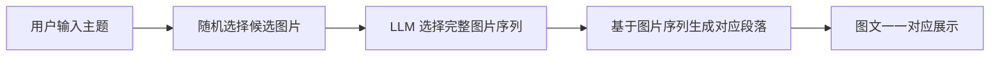

## AI 故事编织者 (AI Story Weaver)

> 通过 AI 将图片库中的多张图片智能串联，自动挑选并生成一个拥有起承转合、图文并茂的短篇故事。用户可选择一个开端图片或输入主题，系统基于"线索提取 → 向量检索 → 故事续写"的循环生成完整故事。

---

### 选择厂商与模型（LLM Provider）
- 通过环境变量 `LLM_PROVIDER` 切换提供方：`openai`（默认）/ `siliconflow` / `tongyi`
- 通用模型名使用 `OPENAI_MODEL`（示例：`gpt-4o-mini`、`qwen-turbo`、或硅基流动上的开源模型名）

示例一：OpenAI（或任意 OpenAI 兼容网关）
```env
LLM_PROVIDER=openai
OPENAI_API_KEY=sk-***
# 可选：若走自建/第三方网关
OPENAI_BASE_URL=https://your.openai.compatible.endpoint/v1
OPENAI_MODEL=gpt-4o-mini
```

示例二：硅基流动（OpenAI 兼容，推荐在中国大陆环境）
```env
LLM_PROVIDER=siliconflow
SILICONFLOW_API_KEY=your_siliconflow_key
SILICONFLOW_BASE_URL=https://api.siliconflow.cn/v1
OPENAI_MODEL=Qwen/Qwen2-7B-Instruct  # 仅示例，按控制台可用模型填写
```

示例三：通义千问（DashScope SDK）
```env
LLM_PROVIDER=tongyi
DASHSCOPE_API_KEY=your_dashscope_key
OPENAI_MODEL=qwen-turbo  # 或 qwen-max / qwen-plus 等
```

说明：
- `siliconflow` 与 `openai` 复用同一客户端（OpenAI 兼容），区别在于 `base_url` 与 `api_key`。
- `tongyi` 使用 DashScope 官方 SDK（已在依赖中加入 `dashscope`）。
- 所有路径与向量库配置仍使用原有 `.env` 字段。

---

### 目标与核心创意
- **核心创意**: 不仅为单张图片生成故事，而是让 AI 从整个图片库中挑选多张图片，将它们串联成完整故事。
- **阅读体验**: 注重"图文并茂"，图片与文字自然衔接，形成起承转合的 4-5 段故事结构（可扩展）。

---

### 功能模块
- **图片库管理**: 图片上传、深度标注（语义描述、对象/场景/情绪）、文本向量化、向量库入库。
- **故事生成引擎**: 根据起始图片/主题生成开篇，提取"故事线索"，在向量库中检索候选图片，续写故事，直到达到长度或生成结尾。
- **用户界面 (UI)**: 展示图片库、选择起点或输入主题、实时显示故事生成过程与最终图文故事。

---

### 架构与数据流
- **技术栈（推荐，易上手）**
  - 应用与 UI: Python + Streamlit（单文件起步，后续可模块化）
  - LLM: OpenAI API（或 Kimi/文心一言等国内厂商 API）
  - Embedding: `sentence-transformers`（中文推荐 `shibing624/text2vec-base-chinese`）
  - 向量数据库: ChromaDB（本地 file-based 持久化）

- **数据流**
  1. 用户选择起始图片或输入主题，确定故事主题
  2. LLM 从 ChromaDB 随机候选中选择完整的图片序列（符合起承转合结构）
  3. 基于选定的图片序列，逐张图片生成对应的故事段落
  4. 每个段落都与指定图片一一对应，确保图文完美匹配
  5. 展示完整的图文故事（图片与段落严格对应）



---

### 目录结构（建议）
初期可单文件 `app.py`；当代码增多后再模块化：

```
AI_Story_Weaver/
├─ assets/
│  └─ images/                  # 图片库
├─ data/
│  └─ chroma/                  # ChromaDB 持久化目录
├─ app.py                      # Streamlit 主应用（起步）
├─ preprocess.py               # 图片深度标注与向量入库
├─ utils.py                    # LLM、Embedding、检索等工具函数
├─ prompts.py                  # Prompt 模板集中管理
├─ requirements.txt            # pip 依赖（Python venv 使用）
├─ environment.yml             # conda 环境配置
├─ .env                        # 私密环境变量（不入库）
└─ README.md
```

---

### 快速开始

#### 环境要求
- **Python**: 3.10+ 
- **操作系统**: Windows 10/11, macOS, Linux
- **内存**: 建议 8GB+（首次运行 sentence-transformers 模型下载需要）

#### 方式一：使用 Conda（推荐）
1. **创建并激活 conda 环境**
   ```bash
   conda env create -f environment.yml
   conda activate ai-story-weaver
   ```

2. **环境变量配置 `.env`**
   - 复制 `.env.example` 为 `.env`
   - 填入你的 API Key：
     ```bash
     OPENAI_API_KEY=your_openai_api_key_here
     OPENAI_MODEL=gpt-4o-mini
     TEMPERATURE=0.3
     TEXT_EMBEDDING_MODEL=shibing624/text2vec-base-chinese
     CHROMA_PERSIST_DIR=./data/chroma
     IMAGE_DIR=./assets/images
     STORY_TARGET_LENGTH=5
     ```

3. **准备图片目录**
   ```bash
   # 将你的图片放入 assets/images/ 目录
   # 注意：assets/ 和 data/ 文件夹内容会被 git 忽略
   ```

4. **首次运行前的预处理**
   ```bash
   python preprocess.py
   ```
   - 功能：遍历 `assets/images`，为每张图片生成"深度标注"（面向故事的语义描述），并将描述文本向量化写入 ChromaDB。

5. **启动应用**
   ```bash
   streamlit run app.py
   ```

#### 方式二：使用 Python venv
1. **创建并激活虚拟环境**
   - Windows PowerShell:
     ```bash
     python -m venv .venv
     .\.venv\Scripts\activate
     ```
   - macOS/Linux:
     ```bash
     python -m venv .venv
     source .venv/bin/activate
     ```

2. **安装依赖**
   ```bash
   pip install -r requirements.txt
   ```

3. **后续步骤同方式一的 2-4 步**

---

### 依赖说明
- **requirements.txt**: pip 依赖列表，适用于 Python venv
- **environment.yml**: conda 环境配置，包含 Python 版本和所有依赖
- **核心依赖**:
  - `streamlit`: Web UI 框架
  - `sentence-transformers`: 文本向量化模型
  - `chromadb`: 向量数据库
  - `openai`: LLM API 客户端
  - `pillow`: 图片处理

---

### 环境变量配置 `.env`
- `OPENAI_API_KEY`: 你的 OpenAI API Key（或其他厂商 API Key）
- `OPENAI_MODEL`: 使用的模型名称（默认 gpt-4o-mini）
- `TEMPERATURE`: 生成随机性（0.0-1.0，建议 0.3）
- `TEXT_EMBEDDING_MODEL`: 文本向量化模型（中文推荐 shibing624/text2vec-base-chinese）
- `CHROMA_PERSIST_DIR`: ChromaDB 数据存储路径
- `IMAGE_DIR`: 图片库目录路径
- `STORY_TARGET_LENGTH`: 默认故事段落数

---

### Prompt 设计与关键策略
- **图片内容描述（预处理阶段）**
  - 目标：简洁全面地描述图片内容，包含主要物体/人物动作、场景环境、色彩光线氛围、重要细节。
  - 特点：语言简洁准确，2-3句话概括图片核心内容，便于后续的向量检索和故事生成。
- **开篇生成**
  - 输入：起始图片的描述或主题
  - 输出：吸引人的第一段，并在结尾埋下"线索"。
- **序列化图片选择与戏剧性故事生成**
  - 流程：从图片库中随机选择 15-20 张候选图片 → LLM 选择富有戏剧性的完整图片序列 → 基于起承转合结构逐张生成对应段落。
  - 特色：
    - 图片选择注重冲突、转折和悬念元素
    - 段落生成融入人物心理、动机和戏剧冲突
    - 严格按照起承转合的戏剧结构安排情节
    - 每段末尾埋下伏笔，增强故事张力
  - 优势：确保图文严格对应，故事更具戏剧性和可读性。
- **检索与重排**
  - 在 ChromaDB 中 Top-K 检索；可对候选做基于"故事一致性"的 rerank（例如与已有段落余弦相似度综合评分）。
- **回退策略**
  - 无匹配图片时：
    - a) 仅凭想象续写一段，并跳过插图；
    - b) 触发结尾生成；
    - c) 降阈值重检索或扩大候选。

---

### UI 使用指南（建议交互）
- 选择"起始图片"或输入"主题关键词"
- 选择"目标段落数"（默认 4-5）
- 点击"开始生成"，右侧实时显示：
  - 当前段落、选中图片预览、线索、候选图片（可选显示）
- 生成完成后可导出为：
  - Markdown / HTML / 图片序列 + 文本

---

### 开发规范与注释
- **Python**: 使用类型注解与函数/类 Docstring（建议 Google 或 NumPy 风格）。
- **JS/TS（若后续加入）**: 采用 JSDoc 注释规范。
- **代码风格**: 推荐 `black` + `isort` + `flake8`；提交前本地格式化。
- **错误处理**: 统一异常封装，避免吞错；必要处打日志。
- **配置安全**: 不要在代码中硬编码 API Key，使用 `.env` 或 `st.secrets`。

---

### 协作指南（Git 工作流）
- **分支策略**
  - `main`: 稳定可演示分支
  - `dev`: 集成开发分支
  - `feature/*`: 功能开发分支（如 `feature/preprocess`, `feature/story-engine`）
  - `fix/*`: 缺陷修复分支
- **提交规范（Conventional Commits）**
  - `feat: ` 新功能；`fix: ` 修复；`docs: ` 文档；`refactor: ` 重构；`perf: ` 性能；`test: ` 测试；`chore: ` 杂项
- **PR 流程**
  - 提交 PR → 自动检查（可后续加入 CI）→ 至少 1 名同学 Code Review → 合并到 `dev` → 定期合并到 `main`
- **任务协作**
  - 建议使用 GitHub Projects/Trello/飞书多维表格做看板，管理需求、任务、里程碑

---

### 分工建议（可按实际团队调整）
- **技术负责人（Tech Lead）**: 架构设计、关键决策、代码评审
- **模型/Prompt 工程师**: Prompt 设计与迭代、线索提取质量优化、回退策略
- **数据与预处理**: 图片收集与清洗、深度标注模板、`preprocess.py` 实现与性能
- **应用与 UI**: `app.py`（Streamlit）交互设计、故事呈现、导出功能
- **检索与向量库**: Embedding/ChromaDB 管理、检索与重排策略
- **测试与文档**: 功能验收、手动测试用例、README/报告撰写

---

### ToDo 列表（里程碑驱动）
- [x] 初始化仓库与基本结构（`assets/images`, `data/chroma`）
- [x] 编写 `requirements.txt` 与 `environment.yml`
- [x] 创建 `.env.example` 环境变量模板
- [x] 预处理流程 `preprocess.py`：
  - [x] 设计深度标注 Prompt 模板（JSON 输出）
  - [x] LLM 调用与速率限制处理
  - [x] Embedding 与 ChromaDB 入库
- [x] 故事引擎：
  - [x] 开篇生成与线索提取
  - [x] 检索（Top-K）与候选重排
  - [x] 续写与回退策略
- [x] UI：
  - [x] 起始图片/主题选择、段落数设置
  - [x] 生成进度可视化、候选浏览
  - [x] 导出 Markdown/HTML
- [ ] 质量与体验：
  - [ ] Prompt 迭代验证（A/B）
  - [ ] 故事连贯性评分（可选）
  - [ ] 错误处理与日志
- [ ] 文档与演示：
  - [ ] 样例图片库与演示脚本
  - [ ] README 持续更新

---

### 手动测试建议
- 用 5-10 张风格多样的图片做小库，覆盖人物、风景、物件。
- 验证：
  - 开篇是否抓住"主题/起点"的关键语义
  - 线索是否稳定可检索，下一张图与文本是否自然衔接
  - 回退策略在无匹配时是否能优雅收敛

---

### 常见问题（FAQ）
- Q: 本地没 GPU 可以吗？
  - A: 可以，本项目默认走云端 LLM API 与开源文本向量模型。
- Q: 生成结果风格不稳定？
  - A: 固定系统 Prompt、减少随机性（降低 `temperature`），并在 README 记录最佳参数与模板。
- Q: 中文 Embedding 效果一般？
  - A: 试 `text2vec-large-chinese` 或结合词向量增强；也可尝试多模型融合与重排。
- Q: 推荐使用 conda 还是 venv？
  - A: 推荐 conda，因为 `environment.yml` 能更好地管理 Python 版本和依赖版本冲突。

---

### 查看向量库（ChromaDB）
- 列出前 10 条：
```bash
python inspect_chroma.py --limit 10
```
- 按元数据过滤（如按文件名）：
```bash
python inspect_chroma.py --where '{"filename":"your.jpg"}'
```
- 文本查询（向量检索）：
```bash
python inspect_chroma.py --query "旧车票" --limit 5
```
说明：脚本会读取 `.env` 中的 `CHROMA_PERSIST_DIR` 与 `TEXT_EMBEDDING_MODEL`。

---

### 启用图片自动描述（多模态 API）
- 目的：让预处理真正“看图写句子”，避免仅用文件名占位描述导致检索不准。
- 支持两类：
  - `LLM_PROVIDER=tongyi` + `IMAGE_CAPTION_MODEL=qwen-vl-plus`（或 `qwen-vl-max`）
  - `LLM_PROVIDER=openai|siliconflow`（使用兼容的 Vision Chat 接口，如 `gpt-4o` 系列或硅基的视觉模型）

示例一：通义千问 Qwen-VL
```env
LLM_PROVIDER=tongyi
DASHSCOPE_API_KEY=your_dashscope_key
OPENAI_MODEL=qwen-turbo           # 文本生成
IMAGE_CAPTION_MODEL=qwen-vl-plus  # 图片描述
```

示例二：硅基流动（OpenAI 兼容 Vision）
```env
LLM_PROVIDER=siliconflow
SILICONFLOW_API_KEY=your_siliconflow_key
SILICONFLOW_BASE_URL=https://api.siliconflow.cn/v1
OPENAI_MODEL=gpt-4o-mini          # 或硅基兼容的视觉模型
IMAGE_CAPTION_MODEL=gpt-4o-mini   # 与上保持一致或填写可用的视觉模型
```

运行：
```bash
python preprocess.py  # 将自动调用多模态接口生成图片描述
```
注：若多模态不可用，将回退到基于文件名的 LLM 文本生成，仍不可用则使用占位描述。

---

### 许可证
- 课程/学习用途优先，若需对外发布请补充合适的开源许可证（如 MIT/Apache-2.0）。

---

### 致谢
- OpenAI / Moonshot / 百度文心 等 LLM 服务
- `sentence-transformers` 与 `ChromaDB` 的优秀开源生态 